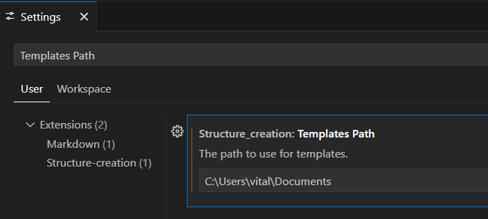

### Edit structure

Use rigth click on the folder than You want edit.


Chose parametrs for selected template and create all neded folders.


If neded You can delete unnesesary changes befor saving.


After You click "Save" button all changes will be created in explorer.


Use global/local settings for change used template file.



For creating own templates:

1. create templateName.jst file and set relative folder in setings
2. use sheme for create own templates
3. and change global or local(workspace) setings.
    - for example You create files in folders with path: "U:/folder/templates/"
    - paste "U:/folder/templates" in setings

```js
//Template_name.jst;

const templates = {
	"$Var_name[Var_type]": "defoult var value", //if name start from symbol $ it is variable and value push to direct use(without precompile)
	"#Sub_var_name[Sub_var_type]": {
		//if name start from symbol # it is variable and value push to direct use with precompile using direct values
		value_1: {
			val: "value that will be compiled and pushed in to variable",
			content: "content if neded",
			file: "file name with modifications, relative to parent folder",
		},
		value_2: {
			val: "",
			content: "",
			file: "",
		}, // You can use one or array of objects for creating any quontity of files.
	},
	// For example:
	"Component_type[radio]": {
		//if name dont start from any symbol it is template precompile using direct values and sub values
		server: {
			content: `{{{Styles}}}
						export default function {{{Capitalize ComponentName}}}() {
							return <{{{Main_tag}}} className="{{{Capitalize ComponentName}}}"></{{{Main_tag}}}>;
						}`,
			file: "{{{Capitalize ComponentName}}}.jsx", //any variable can use in subvars & templates with 3 pairs of brakets {{{var}}}
		},
		client: {
			content: `
						use client
						{{{Styles}}}
						export default function {{{Capitalize ComponentName}}}() {
							return <{{{Main_tag}}} className="{{{Capitalize ComponentName}}}"></{{{Main_tag}}}>;
						}`,
			file: "{{{Capitalize ComponentName}}}.jsx",
		},
		group: {
			folder: "({{{Capitalize ComponentName}}})", //Also if your object dont have "content" you can work with folders
		},
	},
};
```

<h2>Key changes in this version:</h2>
					<ul>
						<li>
						Added support for new template formats and multifile templates
						<br>
						Now you can create templates with multiple files in folders, allowing for easier organization.
						<br>
						(unfortunately, the old templates will not work with this version).
						</li>
						<li>
							added some custom Handlebars helpers to enhance template functionality:
							<br>
							<ul>
								<li>capitalize</li>
								<li>lowerCase</li>
								<li>upperCase</li>
								<li>camelCase</li>
								<li>kebabCase</li>
								<li>snakeCase</li>
								<li>pascalCase</li>
							</ul>
							for example, you can use them like this:
							<pre lang="javascript">{{{capitalize myVariable}}}</pre>
							or
							<pre lang="javascript">{{{camelCase myVariable}}}</pre>
							input text: "my variable" will be transformed to "My variable" or "myVariable" respectively.
						</li>
						<li>Improved template management</li>
						<li>Improved performance</li>
						<li>Bug fixes</li>
					</ul>
