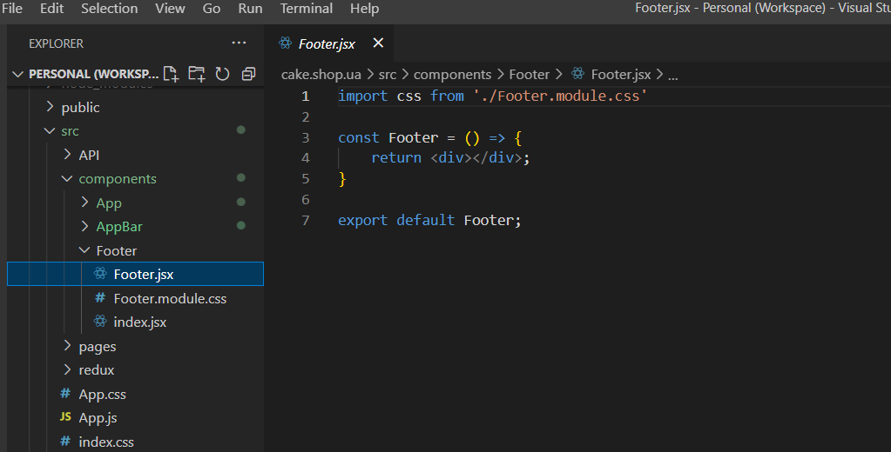

### React component

Use rigth click on the components folder to open the context menu and create new React component structure.

Type component name and press Enter for create basic structure based on global/local settings.

Type .c with component name for create class structure based on global/local settings.

Type .e with component name for create clear structure.

Use global/local settings for change default structure and styles format.

